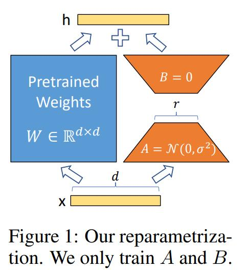

# 大模型基础

## 语言模型

**语言模型定义：** 给定一句由 $n$ 个单词组成的句子 $W=w_1, w_2, \dots, w_n$，计算这个句子的概率 $P(w_1, w_2, \dots, w_n)$，或者根据前文计算下一个词的概率 $P(w_n | w_1, w_2, \dots, w_{n-1})$ 的模型。

**神经网络语言模型：** 训练数据是一个单词序列 $w_1, w_2, \dots, w_T, w_t \in V$，其中字典 $V$ 是一个有限集合。模型的目标是学习一个语言模型：
$$
f(w_t, \dots, w_{t-n+1})= \hat{P} (w_t | w_1^{t-1})
$$
其中，$w_t$ 表示单词序列中第 $t$ 个单词，$w_t, \dots, w_{t-n+1}$ 表示由 $n$ 个单词组成的子序列。整个神经网络语言模型是一个三层的神经网络，最下面的输入即前 $n-1$ 个单词 $w_{t-n+1}, \dots, w_{t-2}, w_{t-1}$，希望通过这 $n-1$ 个单词来预测下一个单词 $w_t$。

## Transformer

目前大模型的基础神经网络架构是Transformer，其基本结构如下图所示，包含N个编码器和N个解码器。

每一个编码器中包含两个子网络，即：一个多注意力头 Multi-Head Attention 和一个前馈神经网络。每个子网络都具有残差连接。

### 自注意力机制

Attention 机制是通过一个 Query（查询变量）从一堆信息（Key-Value 表示的信息，Key 看作信息的地址，Value 表示信息的内容）中找到对于 Query 而言重要的信息，以此获取更多对于 Query 而言更重要的细节信息，进而抑制其他无用信息。

注意力机制的计算步骤如下：

1. 计算 $Q$ 和 $K$ 的相似度：$f(Q,K_i),i=1,2,\dots,m$，对于自注意力机制就是：$f(Q,K_i)=Q^T K_i$

2. 将得到的相似度进行 softmax 操作，进行归一化：
   $$
   \alpha_i = softmax \left(\frac{f(Q,K_i)}{\sqrt{d_k}}\right)
   $$
   这里 $\sqrt{d_k}$ 的作用：假设 $Q,K$  里的元素的均值为 0，方差为 1，那么 $A^T=Q^T K$ 中元素的均值为 0，方差为 $d$。当 $d$ 变得很大时， $A$ 中的元素的方差也会变得很大，如果 $A$ 中的元素方差很大，**在数量级较大时， softmax 将几乎全部的概率分布都分配给了最大值对应的标签**，由于某一维度的数量级较大，进而会导致 softmax 未来求梯度时会消失。总结一下就是 $softmax(A)$ 的分布会和 $d$ 有关。因此 $A$ 中每一个元素乘上 $\frac{1}{\sqrt{d_k}}$ 后，方差又变为 1，并且 $A$ 的数量级也将会变小。

3. 针对算出来的权重 $\alpha_i$，对 $V$ 中所有的 values 进行加权求和，得到 Attention 向量：$Attention=\sum_{i=1}^m \alpha_i V_i$。

**对于 Self Attention，Q、K、V 来自输入句子 X 的词向量 x 的线性转化，即对于词向量 x，给定三个可学习的矩阵参数 $W_Q, W_K, W_V$，x 分别右乘上述矩阵得到 Q、K、V**。这也是Self-Attention 名字的来源：Q、K、V 三个矩阵由同一个词向量线性转化而得。

Self-attention 的矩阵运算示例如下图所示，输入为 $2 \times 4$ 的矩阵（2个词，每个词维度为 4）：

Multi-Head Attention 就是把 Self Attention的过程做 H 次，然后把输出 Z 合起来。

首先，假设使用 8 组不同的 $W_Q^i, W_K^i, W_V^i, i=1,2,\dots,8$，重复 8 次 Self-attention 操作，得到 8 个 $Z_i$ 矩阵：

为了使得输出与输入结构相同，拼接矩阵 $Z_i$ 后乘以一个线性 $W_0$ 得到最终的 $Z$：

multi-head attention 的整个流程如下：

## LoRA

[LoRA (Low-Rank Adaptation)](https://arxiv.org/abs/2106.09685) 是一种高效微调大模型的技术，被广泛用在语言模型、Stable Diffusion 等模型中。如今大模型动辄几十、几百甚至上千亿参数，微调大模型非常困难。而 LoRA 可以只训练原模型不到 1% 的参数量，便可在单卡上实现微调的效果，大大提高了微调的效率。论文 [Intrinsic Dimensionality Explains the Effectiveness of Language Model Fine-Tuning](https://link.zhihu.com/?target=https%3A//aclanthology.org/2021.acl-long.568.pdf) 假设预训练模型在特定任务上微调使具有较低的内在维度，维度指参数矩阵的维数，这意味着在特定子任务上训练预训练模型时，仅微调较少的参数便可以达到全量微调 90% 以上的性能。LoRA 进一步假设模型自适应微调时更新的参数矩阵也有较低的内在维度。假设 $W^{d \times k}$ 为预训练模型的参数矩阵，$\Delta W^{d \times k}$为在特定任务上微调后发生的变化量，由于内在维度较低，可以写为 $\Delta W=BA$，其中 $B \in R^{d \times r}$，$A \in R^{r \times k}$，$r << min(d, k)$。在微调时只需要更新 $\Delta W$ 就行。其原理示意图如下：

根据上图，$h=Wx + \Delta W x=Wx + BA x$。微调结束后，也可以将 $W$ 与 $BA$ 加起来进行模型合并。

## Awesome projects

- [LLMSurvey](https://github.com/RUCAIBox/LLMSurvey)
- [Awesome-Chinese-LLM](https://github.com/HqWu-HITCS/Awesome-Chinese-LLM)
- [Awesome-Multimodal-Large-Language-Models](https://github.com/BradyFU/Awesome-Multimodal-Large-Language-Models)

## 参考

- 《预训练语言模型》
- BERT模型详解：https://www.cnblogs.com/nickchen121/p/15114385.html
- “追星”Transformer：一文说清Transformer：
  - https://zhuanlan.zhihu.com/p/360932588
  - https://zhuanlan.zhihu.com/p/362929145
  - https://zhuanlan.zhihu.com/p/406240067

